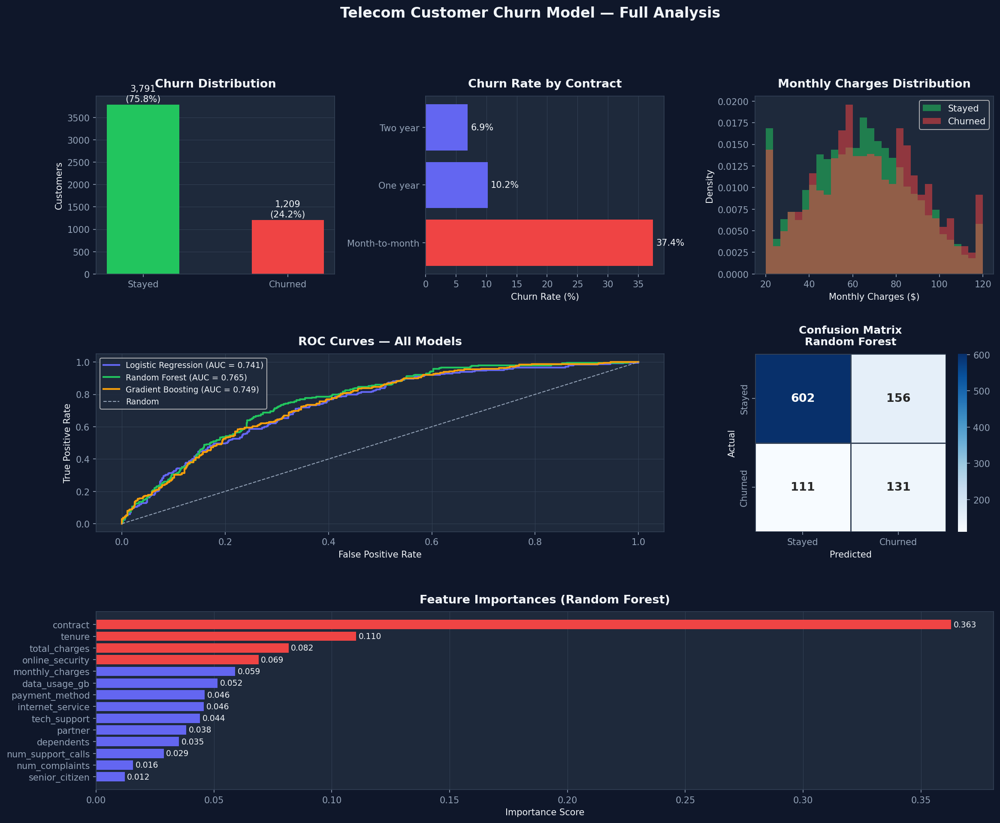

# 📉 Telecom Customer Churn Prediction

An end-to-end machine learning pipeline for predicting customer churn in the telecom industry — from raw data to scored customers with risk segments.


---

## 📊 Results

| Model | ROC-AUC | Avg Precision |
|---|---|---|
| **Random Forest** ⭐ | **0.7651** | **0.4705** |
| Gradient Boosting | 0.7491 | 0.4679 |
| Logistic Regression | 0.7413 | 0.4513 |



---

## 🗂 Project Structure

```
telecom-churn-model/
├── telecom_churn_model.py       # Full ML pipeline
├── churn_scored_customers.csv   # Test set with churn probabilities & risk segments
├── telecom_churn_analysis.png   # 6-panel visual report
└── README.md
```

---

## 🚀 Quickstart

### 1. Clone the repo
```bash
git clone https://github.com/YOUR_USERNAME/telecom-churn-model.git
cd telecom-churn-model
```

### 2. Install dependencies
```bash
pip install scikit-learn pandas numpy matplotlib seaborn imbalanced-learn
```

### 3. Run the pipeline
```bash
python telecom_churn_model.py
```

---

## 🔧 Using Your Own Data

Replace the synthetic data generator with your own CSV:

```python
# In telecom_churn_model.py, replace:
df = generate_telecom_data(N)

# With:
df = pd.read_csv("your_data.csv")
```

Make sure your dataset includes (or rename to match) these columns:

| Column | Type | Description |
|---|---|---|
| `tenure` | int | Months as a customer |
| `monthly_charges` | float | Monthly bill amount |
| `total_charges` | float | Total billed to date |
| `contract` | str | `Month-to-month`, `One year`, `Two year` |
| `internet_service` | str | `DSL`, `Fiber optic`, `No` |
| `payment_method` | str | Payment type |
| `num_complaints` | int | Number of complaints filed |
| `num_support_calls` | int | Number of support interactions |
| `churn` | int | Target: `1` = churned, `0` = stayed |

---

## 🧠 Pipeline Overview

```
Raw Data
   │
   ├── Label Encoding (categorical features)
   ├── Train/Test Split (80/20, stratified)
   ├── SMOTE (handle class imbalance)
   └── Standard Scaling
         │
         ├── Logistic Regression
         ├── Random Forest  ← best
         └── Gradient Boosting
               │
               └── Evaluation: ROC-AUC, Confusion Matrix,
                   Feature Importance, Precision-Recall
```

---

## 🔑 Key Churn Drivers

Based on feature importance from the Random Forest model:

1. **Tenure** — newer customers are far more likely to churn
2. **Contract type** — month-to-month contracts have the highest churn risk
3. **Monthly charges** — higher bills correlate with churn
4. **Number of complaints** — strong predictor of dissatisfaction
5. **Payment method** — electronic check users churn more often

---

## 📦 Output Files

- **`churn_scored_customers.csv`** — every test customer with:
  - `churn_probability` — model confidence score (0–1)
  - `predicted_churn` — binary prediction
  - `risk_segment` — `Low`, `Medium`, or `High`

---

## 📄 License

MIT — free to use, modify, and distribute.
